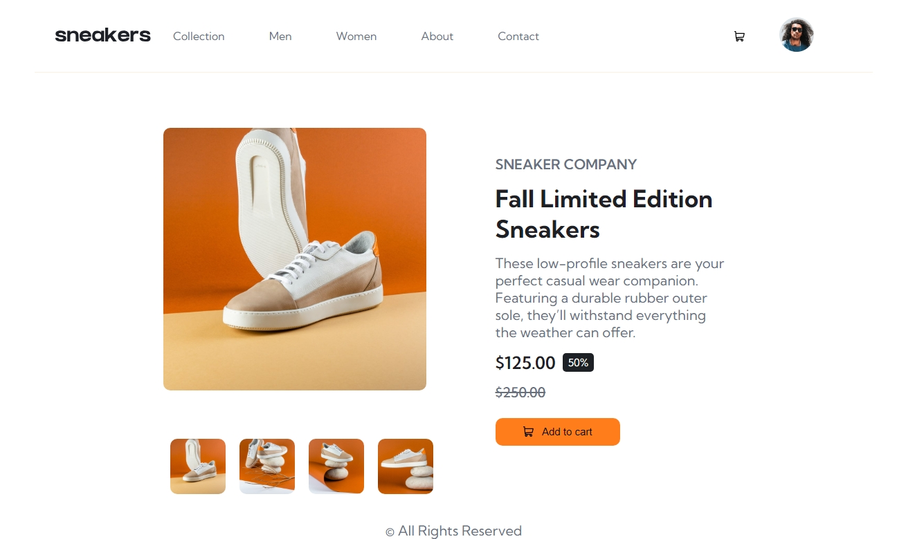
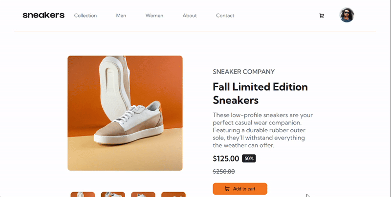
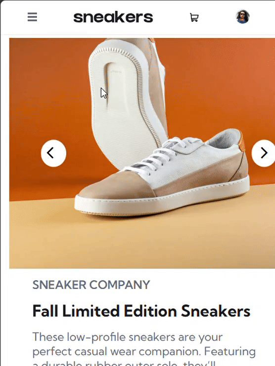

# 🛍️ Ecommerce Product Viewer

A simple, responsive **E-commerce Product Viewer** built with **HTML**, **CSS**, and **JavaScript**.  
This project allows users to view products, switch between different product images, and interact with a clean product UI — providing a smooth and modern shopping experience.

---

## ✨ Features

- 📸 Dynamic product image viewer
- 🎨 Clean and responsive design
- 📱 Mobile-friendly layout
- ⚡ Fast and lightweight

---
## 📸 Screenshots


--
## 📸 Screenshots


## 🚀 Demo

👉 [View Live Demo](#) (You can update this with your GitHub Pages/Netlify link if deployed!)

---

## 🛠️ Tech Stack

| Tech | Description |
|:----:|:------------|
|  | Markup structure |
|  | Styling and layout |
|  | Dynamic interactivity |

---

## 📂 Project Structure

```
Ecommerce-product-viewer/
│
├── index.html       # Main HTML file
├── style.css        # Styling for the product viewer
└── script.js        # JavaScript to handle dynamic interactions
```

---

## 📸 Screenshots

| Desktop View | Mobile View |
|:------------:|:-----------:|
|  |  |

*(You can add images/screenshots later if you want.)*

---

## 📈 Future Improvements

- 🛒 Add "Add to Cart" functionality
- 🏍️ Integrate with a product catalog backend
- 🖼️ Add product zoom on hover
- 🌐 Deploy for public demo

---

## 🧬 Contributing

Contributions are welcome!  
Feel free to fork this repository, raise an issue, or submit a pull request.

---

## 📄 License

This project is open-source and available under the [MIT License](LICENSE).

---

## 🔗 Connect with Me

- [](https://linkedin.com/in/kishanshr/)
- [](https://github.com/Kishan-shr)
